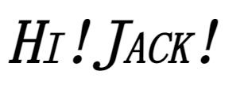

### 本文重要内容

* CSS的单位
* 字体属性
* 文本属性
* 定位属性：position、float、overflow等

### CSS 的单位

html 中只有一种单位——像素px，故可省略

css 里面一堆单位，所以 **CSS中的单位是必须要写的** ，因为它 **没有默认单位**。

#### 绝对单位与相对单位

##### 绝对单位

1 `in`=2.54 `cm`=25.4 `mm`=72 `pt`=6 `pc`。

各种单位的含义：

* `in`：英寸Inches (1 英寸 = 2.54 厘米)
* `cm`：厘米Centimeters
* `mm`：毫米Millimeters
* `pt`：点Points，或者叫英镑 (1点 = 1/72英寸)
* `pc`：皮卡Picas (1 皮卡 = 12 点)

##### 相对单位

- `px`：像素（电脑分辨率不同导致像素点大小不同）
- `em`：印刷单位相当于12个点
- `%`：百分比，相对周围的文字的大小


(偷懒就直接放网图了hhh)

### font 字体属性

CSS 中不但有很多关系到布局的属性，还有很多与布局无关的非布局样式，包括：字体、行高、颜色、大小、背景、边框、滚动、换行、装饰性属性（粗体、斜体、下划线）等。

```css
p{
	font-size: 50px; 		/*字体大小*/
	line-height: 30px;      /*行高*/
	font-family: 幼圆,黑体; 	/*字体类型：如果没有幼圆就显示黑体，没有黑体就显示默认*/
	font-style: italic ;		/*italic表示斜体，normal表示不倾斜*/
	font-weight: bold;	/*粗体*/
	font-variant: small-caps;  /*小写变大写*/
}
```



我焯，好酷炫，注意一下换成大写后的大小关系

#### 行高

行高和文字大小没有半毛钱关系，是作用于“行”上的（抽象理解一下就是装文字的盒子）。


大家怕自动分除不尽，就约定俗成 **行高、字号，一般都是偶数**，蛮怪的
