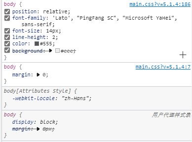

### CSS 的继承性

打开 test6 文件并渲染页面，仔细观察，你会发现我们只使用了一个标签选择器，而且最关键的还是这个选择器的作用对象仅仅只是 div，然鹅内部的 p 标签也受到了部分影响（具体就是 color 都变了，border 只影响 div）

这里就可以看出 css 具有一定的继承性：color 属性继承到了子项，而border 没有继承性所以没有影响子项。

#### 关于属性的继承性

具有继承性的：

* 关于文字样式的属性，都具有继承性。这些属性包括：color、 text-开头的、line-开头的、font-开头的。

#### **不具有继承性的：**

* 关于盒子、定位、布局的属性，都不能继承。

### CSS 的叠层性

**定义：css 处理冲突的能力**

不用说太多，打开浏览器对某些布局看起来比较复杂的网页按下 F12，你肯就会看到：



看到那些例如“~~background~~”的被划去的属性了吗？那就是被顶替掉的属性。事实上，css 在处理具有冲突的代码时有自己的一套规则。

#### CSS 选择器权重计算

当多个选择器，选择上了某个元素的时候，要按照如下顺序统计权重：

* id 选择器
* 类选择器、属性选择器、伪类选择器
* 标签选择器、伪元素选择器

**因为对于相同方式的样式表，其选择器排序的优先级为：ID选择器 > 类选择器 > 标签选择器**


如上图所示，统计各个选择器的数量，优先级高的胜出。文字的颜色为红色。

> 不进位，实际上能进位（奇淫知识点：255个标签，等于1个类名），太草了

不过嘛，既然是比较，那么也就可能出现权重相同的情况：**此时 CSS 会选择靠后的样式，将前面的顶替掉**

以上的只是正好被选中的情况，假如我只是利用继承性来简介选择呢？这种情况下，就看谁描述的更接近了：假如有 div 包含 ul 包含 li，目标是最内侧的 li，这个时候使用“div ul”就比“div”描述的更接近目标，即 **语义就近**

**另外，如果不能直接选中某个元素，通过继承性影响的话，那么权重是0（对目标元素而言）。**

#### 总结

* 1、对于相同的选择器（比如同样都是类选择器），其样式表排序：行级样式 > 内嵌样式表 > 外部样式表（就近原则）
* 2、对于相同类型的样式表（比如同样都是内部样式表），其选择器排序：ID选择器 > 类选择器 > 标签选择器
* 3、外部样式表的ID选择器 > 内嵌样式表的标签选择器

### 搅屎棍 !important

这玩意是加在属性后面将该条属性的权重上调至无穷大的标识（注意只能作用于一条属性！而不是整个选择器！）

```css
div{
   color: red !important;/*注意这个标识在";"左边！*/
}
```

另外，三点强调：

1. **!important 提升的是一个属性，而不是一个选择器**
2. **!important 无法提升继承的权重，该是0还是0**
3. **!important 不影响就近原则**

一般不要乱用这个标识，不然极其容易导致结构混乱（所以说是搅屎棍呢~）
